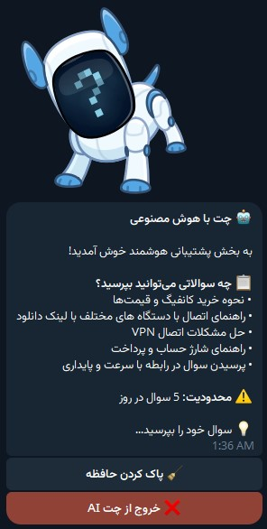
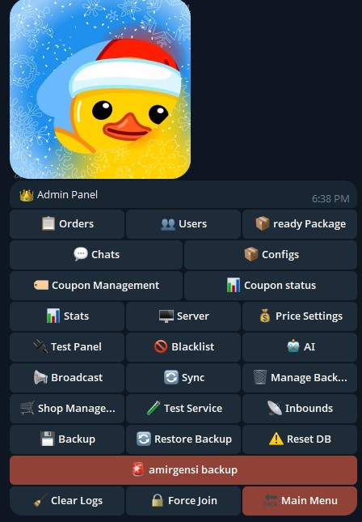

# VeloraBot

<div align="center">

# VeloraBot

### Telegram VPN Configuration Management Bot

Python-based Telegram bot for automated VPN configuration sales, user management, payments, referrals, service renewal, and configuration delivery.

<br>

[](https://www.python.org/)
[](https://github.com/MHSanaei/3x-ui)
[](https://github.com/navidmn56/VeloraBot)

</div>

---

## Overview

VeloraBot is a Python-based Telegram bot designed to automate VPN configuration sales and management through the **MHSanaei 3X-UI** panel.

The bot provides an automated environment for selling and managing VPN configurations directly through Telegram.

It supports user management, payments, referrals, configuration delivery, service renewal, logging, and optional AI-powered support.

VeloraBot is specifically designed to work with the **MHSanaei 3X-UI API**.

---

## Features

| Feature                    | Description                                              |
| -------------------------- | -------------------------------------------------------- |
| **Telegram Bot**           | User and administrator management through Telegram       |
| **VPN Sales**              | Sell and automatically deliver VPN configurations        |
| **3X-UI Integration**      | Manage clients and configurations through MHSanaei 3X-UI |
| **Service Renewal**        | Allow users to renew existing VPN services               |
| **Payments**               | Balance management, orders, and receipt handling         |
| **Referrals**              | Referral links and reward system                         |
| **AI Support**             | Optional Google Gemini integration                       |
| **Logging**                | Application and Telegram logging                         |
| **Configuration Delivery** | Automated configuration and subscription delivery        |
| **User Management**        | Manage users and their services                          |
| **Local Data Storage**     | JSON-based runtime data storage                          |

---

## 3X-UI Integration

VeloraBot is developed specifically for:

**MHSanaei 3X-UI**

https://github.com/MHSanaei/3x-ui

Other VPN management panels are not supported.

Compatibility with future 3X-UI releases is not guaranteed until they are tested with VeloraBot.

---

<details>
<summary><strong>📸 Screenshots</strong></summary>

<br>

### Ai Support

<div align="center">



</div>

<br>

### Admin Panel

<div align="center">



</div>

</details>

---

## Requirements

Before installing VeloraBot, make sure your server has the following:

* Linux server
* Python 3.10+
* Git
* Telegram Bot Token
* MHSanaei 3X-UI
* 3X-UI API access

---

## Installation

### Quick Installation

VeloraBot includes an installation script that can automatically install and configure the bot.

Run:

```bash
sudo bash -c "$(curl -fsSL https://raw.githubusercontent.com/navidmn56/VeloraBot/main/install.sh)"
```

The installer can handle installation and update operations automatically.

---

### Manual Installation

If you prefer to install VeloraBot manually, follow the steps below.

### 1. Clone the Repository

```bash
cd /opt
git clone https://github.com/navidmn56/VeloraBot.git
cd VeloraBot
```

### 2. Install Python Requirements

```bash
sudo apt update
sudo apt install -y python3-venv python3-pip
```

### 3. Create a Virtual Environment

```bash
python3 -m venv .venv
```

Activate the environment:

```bash
source .venv/bin/activate
```

### 4. Install Dependencies

```bash
pip install -r requirements.txt
```

### 5. Configure the Bot

Open the configuration file:

```bash
nano config.py
```

Configure your Telegram bot, 3X-UI panel, and other required settings.

### 6. Run the Bot

```bash
python main.py
```

---

## systemd Service

For production environments, it is recommended to run VeloraBot as a systemd service.

Create the service file:

```bash
sudo nano /etc/systemd/system/velorabot.service
```

Add:

```ini
[Unit]
Description=VeloraBot
After=network-online.target
Wants=network-online.target

[Service]
Type=simple

User=root
WorkingDirectory=/opt/VeloraBot

ExecStart=/opt/VeloraBot/.venv/bin/python /opt/VeloraBot/main.py

Restart=always
RestartSec=5

Environment=PYTHONUNBUFFERED=1

[Install]
WantedBy=multi-user.target
```

### Enable and Start the Service

```bash
sudo systemctl daemon-reload
sudo systemctl enable velorabot
sudo systemctl start velorabot
```

---

## Service Commands

### Check Status

```bash
sudo systemctl status velorabot
```

### Restart

```bash
sudo systemctl restart velorabot
```

### Stop

```bash
sudo systemctl stop velorabot
```

### Start

```bash
sudo systemctl start velorabot
```

### View Live Logs

```bash
sudo journalctl -u velorabot -f
```

---

## Update

If you installed VeloraBot manually, you can update it with:

```bash
cd /opt/VeloraBot

sudo systemctl stop velorabot

git pull origin main

source .venv/bin/activate

pip install -r requirements.txt

sudo systemctl restart velorabot
```

If you installed VeloraBot using `install.sh`, you can use the installer to handle the update process.

---

## Versioning

VeloraBot follows semantic versioning.

### Current Release

**v1.1.0**

The `v1.1.0` release introduces the **Service Renewal** functionality.

Version format:

```text
vMAJOR.MINOR.PATCH
```

Examples:

```text
v1.0.0
v1.1.0
v1.1.1
```

* **MAJOR** — Breaking changes
* **MINOR** — New features
* **PATCH** — Bug fixes and small improvements

---

## Project Structure

```text
VeloraBot/
├── data/
│   └── .gitkeep
├── docs/
│   └── screenshot/
│       ├── Screenshot.png
│       └── Screenshot3.jpg
├── .gitignore
├── config.py
├── install.sh
├── logger_system.py
├── main.py
├── requirements.txt
└── test.py
```

Runtime files generated inside `data/` are ignored by Git.

---

## Data Storage

VeloraBot currently uses local JSON-based runtime storage.

Runtime data is stored inside:

```text
data/
```

These files are intentionally excluded from Git through `.gitignore`.

---

## Configuration

The main configuration file is:

```text
config.py
```

Before starting the bot, make sure the required Telegram and 3X-UI settings are correctly configured.

Never commit private credentials, bot tokens, passwords, API keys, or other sensitive information to the repository.

---

## Compatibility

VeloraBot is currently designed for:

```text
MHSanaei 3X-UI
```

The bot depends on the 3X-UI API and may require changes when future 3X-UI versions introduce API or structural changes.

---

## Development Status

VeloraBot is actively developed.

New features, improvements, and bug fixes may be added regularly.

The project may still contain bugs or unexpected behavior.

---

## Contributing

Contributions, bug reports, and feature suggestions are welcome.

If you find a bug or have an idea for improving VeloraBot, feel free to open an issue or submit a pull request.

---

## Author

<div align="center">

**Navid**

GitHub:

https://github.com/navidmn56

Project:

https://github.com/navidmn56/VeloraBot

</div>

---

<div align="center">

### VeloraBot

**Telegram VPN Configuration Management Bot**

</div>
